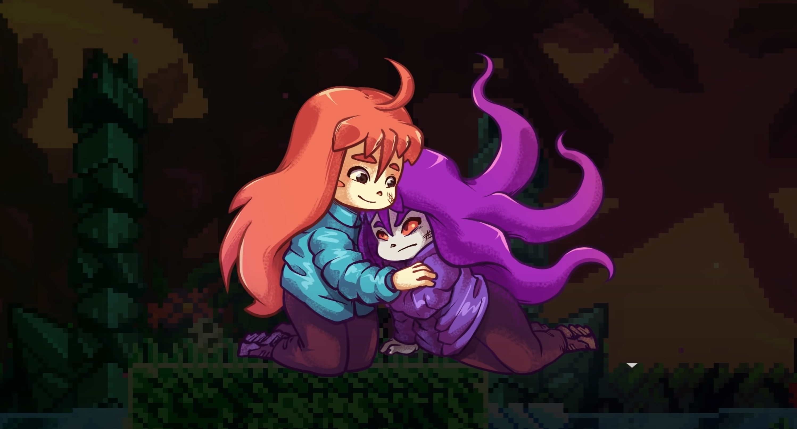
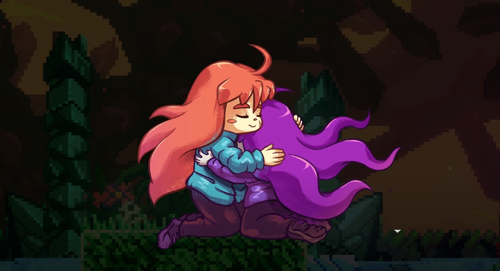
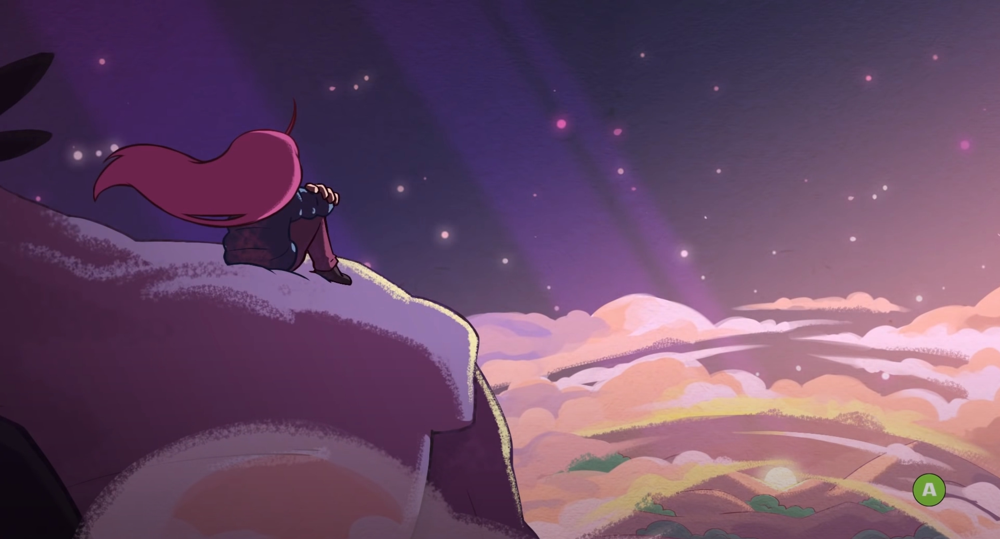

我在摸索 Unity3D 時，第一個想做的遊戲是 platformer。做著做著覺得沒什麼手感才想起：我根本不太玩 platformer。想做不是因為自己想玩，是因為這個類型給我一種獨立遊戲感。所以，雖然對 platformer 不是特別有熱情，我仍然玩了兩款名作來體驗與研究。

第一款是〈Ori and the Blind Forest〉，過去幾年談到 platformer 不會錯過的經典作品。優秀的美術與音樂，良好的操作性與關卡設計，很不錯的遊戲。遊戲中有不少劇情鋪陳與敘述的橋段，佐以其傑出美術所營造的世界觀，我當時猜想主要可以從 Ori 學習的部分是文本方面。不是說它的動作性與遊戲性不好，而是劇情與世界觀更為印象深刻。

而第二款，[The Game Awards](https://thegameawards.com/) 的 2018 年的年度最佳獨立遊戲〈Celeste〉，我對它的印象是大量的動作要素以及高難度。曾經在 Youtube 看過說明 Celeste 的操作為何如此優秀的解說影片，在開始之前，我猜想這款遊戲不同於 Ori，主要將成為動作性與遊戲性的學習資料。

Oh boy was I wrong.

## A good action platformer

Celeste 是個講求精確操作的關卡驅動 platformer。每一個關卡都是一個謎題，有明確的起點與（複數）終點，謎題內容也就是阻止玩家抵達終點的阻礙都明顯可見，玩家必須安排自己的資源（跳躍、衝刺、攀爬及其他環境要素）並正確執行操作以解開謎題。遊戲本篇有 7+1 大關，每個大關有約 50 個小關，而蒐集隱藏要素可以開啟 B 面，關卡數再翻倍。

就如同我事前的印象，Celeste 並不簡單。就算不蒐集對 B 面卡帶以及結局沒有影響的草莓，一個大關死幾百次，破關死上千次也是很正常的事。但我認為 Celeste 的關卡設計合理，具挑戰性但隨機要素低，所以不至於感到挫折（至少我自己不會）。

但要說我對 Celeste 的動作性感到感動嗎，其實卻又還好。大概是因為遊戲由大量的小關卡堆疊而成，會感到高度成就感的「特殊瞬間」大概只有在大關結束的時候。舉個對比的例子，Ori 的逃脫關卡這種融入大量演出的部分就很有解決一個難關的爽快感。

## Storytelling in dialogue

"Celeste" 這個名稱來自遊戲劇情，主角 Madeline 立志攀爬的一座山。2D platformer 目標是抵達一個終點，而這次的終點是山頂，看起來非常合理，一開始我也沒想太多。在山腳她遇到了質疑她的居民 Old Women，述說著 Mt. Celeste 的危險以及奇異之處。

> Old woman: Mountain Celeste is a strange place. You might see things. Things you ain't ready to see.

看起來像是很正常的序章描寫。

第一章的舞台是山腳一座被遺忘的城市，在這裡 Madeline 會遇到另一名旅人 Theo。相較於前一名 NPC，Theo 看起來正常許多，就只是單純想享受旅行，不會故作神秘隨時丟出一些令人摸不著頭緒的不明話語。而從兩人的對話中，可以看出 Madeline 並不非常抱有自信。她仍然表示目標山頂，不會輕易回頭，但在兩人最初的幾句交談中，她的回話包含著不確定以及遲疑。整體而言，第一章包含著教學要素，難度並不高。

第二章的舞台是廢墟，這一關會出現 Madeline 以外整個遊戲最重要的角色：Badeline。她在 Madeline 靠近一面大鏡子作為 Madeline 的倒影登場，隨即打破鏡子逃至現實世界。之後兩人對峙，Madeline 立刻察覺對方就是自己。又或者，自己的一部分。這段對白，就如同全作的對白，寫得極為自然，甚至讓人感到自己也曾經歷的既視感。

> B: You are many things, darling, but you are not a mountain climber.

> M: Who says I can't be?

> B: You have no idea you're getting into. You can't handle this.

> M: That is exactly why I need to do this.

Badeline 的話聽起來就像是那些口口聲聲「我是為你好」的第三者，但事實上只是一再否定他人的意志。語畢，Badeline 開始攻擊 Madeline。她會模仿玩家的行動軌跡，只要玩家撞上她就會死亡。由於遊戲至此都沒有任何敵人，在遊戲前期的第二章增加一個敵方角色感覺也挺正常的。

第三章的舞台是山腰一座廢棄旅館 Celestial Resort Hotel，在這裡 Madeline 會遇到一名孤身守著空洞的旅館，祈求客人上門的鬼魂 Mr. Oshiro。旅館滿佈灰塵以及雜亂擺放的物品，而 Mr. Oshiro 卻無視現實，滿腦子該如何推銷旅館給客人留下好印象讓他們留宿。在 Madeline 一邊前進一邊清理旅館之後，Badeline 再次現身，勸告 Madeline 不要理會這可悲的失敗者，直指這旅館就是個垃圾。在 Oshiro 崩潰之前，玩家可以看到他的自言自語：

> Mr. Oshiro: Why would she say my beautiful hotel is a dump?  
> Mr. Oshiro: How dare she insult you like that.  
> Mr. Oshiro: What if she is right?  
> Mr. Oshiro: Of course she's right, you couldn't clean up without her help.

最後他崩潰道：

> Mr. Oshiro: You only came here to humiliate me... I won't grovel at your feet any longer!

然後就變成另一個敵人開始瘋狂攻擊玩家。

到這裡我才開始了解，Celeste 不只是一個只有動作性的 2D platformer，它的故事都圍繞在心理健康這個主旨上。Badeline 很明顯地代表自我質疑與否定，Mr. Oshiro 代表渴望受到肯定與無視現實。

了解遊戲的主題後，就比較對遊戲可能的方向有底了。第四章舞台佈滿尖刺，伴隨著陣陣強風，有時妨礙，有時幫助玩家跳躍。最後 Madeline 與 Theo 需要搭乘纜車才能前往下一個區域，但纜車途中故障。在這裡 Madeline 終於對他人表達了自己的焦慮與恐懼。

> M: No, this really isn't good.

> T: Madeline, you cool?

> M: Yeah... I just...
No, I'm not cool. I can't breath.

但 Theo 仍然留在 Madeline 身邊幫助她。他運用了一種從祖父學來的讓自己平靜下來的方式，想像一根飄浮的羽毛，深呼吸，讓一切慢下來。這個方法成功解除了 Madeline 的焦慮，纜車也神奇地再次開始運轉。

第五章是一座名為 "Mirror temple" 的神秘寺廟，Theo 興奮表示他的 "InstaPix" 追隨者會喜歡這裡的照片後就獨自衝了進去。之後 Madeline 發現了被關在水晶裡的他，周遭背景則是一隻隻盯著 Theo 看的大眼睛。在 Madeline 解救他並逃出寺廟之後，兩人在出口外休息並展開了一場長談。

這段長談甚至提供對話選項給玩家選擇，是整個遊戲唯一一次。從兩人的對話中可以看出 Theo 是這個困難且不友善的環境中唯一對 Madeline 伸出援手的人。也許是長談給了 Madeline 決心與勇氣，Theo 睡去以後 Madeline  再次對峙 Badeline，她想要拋棄 Badeline，自己心中黑暗的那一面。

> M: I finally understand who you are. You are not my true reflection. You are everything I need to leave behind.

Madeline 在這段對話看來無比自信與樂觀，相信可以拋棄不完美的自己，相信自己握有對自己心裡的主控權。結果 Badeline 反咬，帶來更強烈的焦慮。Madeline 嘗試想像羽毛，卻被 Badeline 一刀兩斷並拖進山谷底部。一度近在眼前的山頂如今遙不可及，而對話帶來的技巧與勇氣也不再無敵。這一刻的 Madeline 心理上生理上都掉進了這趟冒險的新低點。

第六章山谷的前半是寂靜的獨行。沒有任何人可以對話，也沒有對舞台的想法，甚至沒有鑰匙或是明顯的出口之類的短程目標，Madeline 只能靜靜地前往任何可以前進的方向。

半途，Old woman 再次出現。Madeline 在對話中表示放棄。更正確的說，嘴巴上說著放棄，但心裡還有不甘，卻又不認為自己有辦法達成目標。

> M: You know what? I had a lot of time to think, climbing out this cave... and I'm already over it. That part of me was right, I can't do this. I'll just... go home to my sad life and be miserable forever.

> Old woman: You clearly aren't over it.

> M: Shut up, I know. I don't want to give up... but no matter how hard I try, she sabotages me every step of the way.

最後，Old woman 給出了旁觀者的中立建議。

> Old woman: This girl you're talking about, it sounds like she's holding your back. Talk to her. Figure out why she's so scared.

第一次，Madeline 了解到 Badeline 不是為了反對而反對，而可能是因為：她在害怕。從這一刻開始，Madeline 才開始嘗試與 Badeline 對話。一直以來都在逃離 Badeline 的她，現在反過來追逐 Badeline 試圖面對面談話，而後者不斷逃跑。這段是整個遊戲中唯一可以算是 Boss 戰的部分，Madeline 要躲避 Badeline 丟出的攻擊以及環境的危險部分並接觸 Badeline 數十次。終於，Badeline 放棄反抗。

> B: Fine. You win. I guess you don't need me after all. If you want me to go away, I'll try.

> M: That's not what I want. I need your help now more than ever. Please. Let's work together.

> B: Work together? You're joking, right?

> M: It's okay to be scared.

在這一刻，持續在背景咆哮的風暴終於平息，一切都安靜了下來。

接納了另一部分自己的 Badeline 回到 Madeline 體內，然後角色能力成長，現在 Madeline 可以衝刺兩次也就是三段跳，原本無法前往的地區都變得有可能了。

之後 Madeline 會遇到另一個 Badeline 現身幫助她向上飛行一大段距離的事件。在這樣的幫助下，重回山頂並不是夢想。Badeline 仍然抱有質疑，但這並不代表她不想嘗試，而只是對過去以及未來可能再次面對的失敗感到害怕。

> M: I understand you're scared. But we both know that this is something we want to do. We have to try one last time.

> B: I don't know... We were so close, then we, uh, fell...

> M: Yeah, that happened. But I have to believe we can put that behind us. I have to believe we're capable of this.

> B: ... Okay. I'll try.

之後就是遊戲的最後一章，Madeline 必須從山谷一路爬回山頂，途中經過的每一個區域都是之前走過的關卡，而區域最後 Badeline 就會出來助 Madeline 一臂之力，帶她到下一個區域。

經過 Mirror Temple 區域，同時代表兩人終於回到之前對峙與摔落山谷前的進度時，兩人進行了另一段對話 (抱歉我就這樣把整段對話貼上來，但兩人和解之後的每一句對白都太具意義了，實在難以割捨)。

> M: This is it, the home stretch. We're so close. We're going to make it!

> B: Yeah...

> M: What's wrong?

> B: I'm just... I'm sorry. I was holding you back. I need to learn to trust you.

> M: It's not your fault. I tried to leave you behind. And honestly, I've been trying to leave you behind my entire life. I'm sorry. I wish I tried to understand you sooner. I was to proud, or stubborn or something.

> B: We wasted so much time and energy. ... At lease we're finally talking about it.

> M: Yeah... I'm glad the Mountain brought you out. I think we can move past this. If we can climb this Mountain together, we can do anything.

> B: What if we don't make it?

> M: I'd be okay with that.

> B: You would?

> M: Of course. I'm just glad we're trying. I really needed to do this.

> B: I'm finally starting to understand why. Let's finish it!

接著就是遊戲的最後一個區域，兩人之前從未抵達過的山頂區域。從這裡開始每走一小段就會出現一個寫著數字的告示牌，越前進數字越小，倒數著離終點還有多遠。第一個告示牌是 30 號，看來還是一個相當遙遠的數字，但每次數字變小都確切地代表著 Madeline 的進度。

終於，Madeline 迎來了編號 1 號的告示牌以及最後一段天堂路，踏上了 Mt. Celeste 的山頂。Madeline 與 Badeline 兩人一起享受著山頂的美景，以及彼此努力的成果。

Credit roll 結束後，所有登場人物都集結在 Old woman 在山腳的家，Madeline 用旅途上收集到的草莓烤了草莓派給大家吃。這是她第一次作草莓派，開動前還給 Theo 打了預防針說不要太期待。Mr. Oshiro 用一句話為這個故事劃上了完美的句點：

> Mr: Oshiro: The important thing is that you tried your best, Ms. Madeline.

## Storytelling in gameplay

從以上我引用了這麼多對白應該可以看出，我對本遊戲的對白給予非常高的評價。仍然是那兩個字，自然。Celeste 的對白特別讓我感到沉浸，沒有創作物的隔閡感，而是我真的有可能在日常生活看到聽到的對話。Celeste 畢竟是個獨立 2D platformer，沒有壯大的過場與高水準動畫，大部分劇情鋪陳都只靠角色的表情圖像以及文字建立，但寫出的劇情與角色轉折卻讓我極為感動。

背景音樂也是另一個本作非常優秀的地方。旋律吸引人只是基本，Celeste 的背景音樂強烈反映故事以及 Madeline 的心理現狀。當 Badeline 初次登場並顯露出阻止 Madeline 的意圖時，原本充滿神秘感的音樂突然加快節奏，配合著 Madeline 被追趕的現狀，以及對廢墟與 Badeline 的大量疑問。又或者是纜車上 Madeline 遭遇焦慮來襲時，音樂也變得充滿壓迫感。

在由作曲者 Lena Raine 本人[上傳至 Youtube 的原聲帶](https://www.youtube.com/playlist?list=PLe1jcCJWvkWiWLp9h3ge0e5v7n6kxEfOG)評論欄中有人這麼提問：「Lena Raine, 如果妳不願意可以不用回答，但這款遊戲在妳心中是不是有份特別的意義？我只是覺得曲子中充滿了感情，感覺妳完全理解 Madeline 的心情並透過音樂漂亮地詮釋了出來，幾乎就像這些事是發生在自己身上一樣。不是說想否定妳針對特定主題作曲的能力，我只是感覺這些音樂裡充滿了感情，而不只是一份工作而已。」

Lena 回以肯定的回答：

> Absolutely. In a lot of ways it was a very personal soundtrack for me.

( Celeste OST 有[網路販售](https://radicaldreamland.bandcamp.com/album/celeste-original-soundtrack)，實體版跟數位版都有，強烈推薦支持一下 )

然而，讓我對本作的評價從感動昇華到敬佩的，是作者 Matt Thorson 如何把對遊戲主題的描寫融入 gameplay 中。Celeste 的關卡不是只為了有難度的 2D platformer 存在，而蘊含著它在這個故事的意義。

Celestial Resort Hotel 是一個很明顯的例子。Mr. Oshiro 忽視旅館骯髒又雜亂的現實，忽視 Madeline 很明顯對投宿沒興趣的部分，只一心期望對方能喜歡自己。這些被忽視的現狀已經開始影響他與他人的互動，玩家操縱的 Madeline 為了與他對話必須繞過重重障礙，也就是一個個的關卡。而當他受到言語刺激崩潰之後，原本無害的 NPC 又變成會瘋狂追擊玩家的敵人。

另一個例子，遊戲裡殺玩家最多次的，一個是 Badeline ，另一個就是關卡本身的障礙。也就是說，玩家在這個遊戲最主要面對的挑戰，一個是自我質疑，一個是外在環境。這個遊戲的外在環境一點都不友善，而且它沒有理由友善。另外，除了在山谷嘗試與 Badeline 對話時必須操控角色接觸她以外，整個遊戲 Madeline 也就是玩家需要做的都是逃離與躲避危機，而不是面對它。

最後，從本質的角度來看，Celeste 就是一個不斷重複嘗試與失敗的遊戲。這些嘗試一點都不簡單，玩家非常有可能玩到怒關遊戲或是怒摔手把，但絕非不可能。只要玩家勇於面對自己失敗，勇於不斷嘗試，收集所有草莓、完成B面，都是時間的問題而已。Celeste 述說一個少女不畏挑戰面對內心找回自己的故事，同時玩著這個遊戲的一個個玩家又都是另一個面對挑戰勇於嘗試的故事。這個跨越第四道牆，文本內文本外都表達同一個價值的 gameplay，實在太過出色。

## Reflection from a story

我很幸運，人生幾乎沒有發生過嚴重的心理健康問題，最後一次也是好幾年以前，但我知道社會上的很多人沒有這麼幸運。我不敢說能感同身受，但當他們願意述說自己遭遇的困難時，我總是尊重並嘗試理解。我知道這是現今社會的一個常見問題，所以當一個我最喜歡的藝術載體以精妙的手法試圖喚起大眾對這個議題的注意時，我怎能不感動與讚歎呢？

比如說，League 是對我人生影響第二大的遊戲，玩了十年我仍然非常喜歡它，但有超過一半的場次我都會遇到尺度比較小的心理問題，不是在自己身上，而是在其他玩家身上。

大部分人都想贏，如果是自己 carry 贏更好。但競技遊戲畢竟有輸有贏，而當一場遊戲不如自己理想時，很多人就會表達出強烈的挫折感。我到 season 3 為止也曾有這樣的傾向，就算是現在我也不敢說我能 100% 控制好自己的情緒 ( 95% 應該是有啦 )，所以遇上有這個現象的其他玩家，我一點也不意外。

在玩過 Celeste  之後，每次有人在 first blood 之後喊 ff15，在我眼裡都充滿 Badeline 那害怕失敗、害怕努力付之流水、對現實不如理想的挫折感等等綜合情緒的既視感。在我眼裡那不是憤怒，不是 troll，都是害怕與挫折，而有太多人不知道如何面對挫折，如何處理挫折。而若連玩 League 都是這樣，生活中必定會遇到更多更大，更不知如何處理的挫折與情緒問題。

所以，我真的很希望每個人都玩玩看 Celeste。事實上，如果要我選出一個「十款所有人都該玩玩看的遊戲」清單，Celeste 一定會被我放在裡面。它也許不是最「好玩」的遊戲，但作為一個使用遊戲這個藝術載體的文本，Celeste 是極為優秀的作品，而這個作品想傳達的價值，我相信每個人在生活中都會遭遇到。遊玩過程中你可能會失敗上百上千次，你可能會很挫折，但重要的不是你是否成功，而是——

你是否盡力嘗試過了。