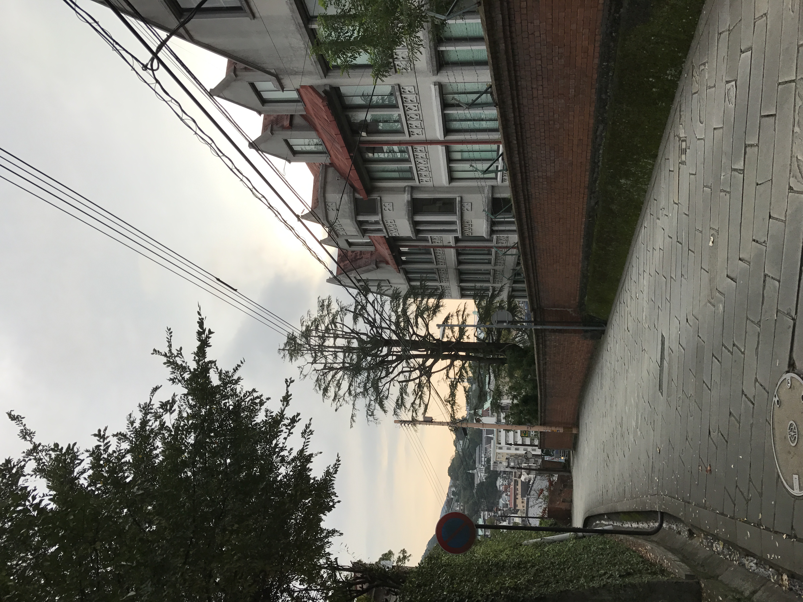
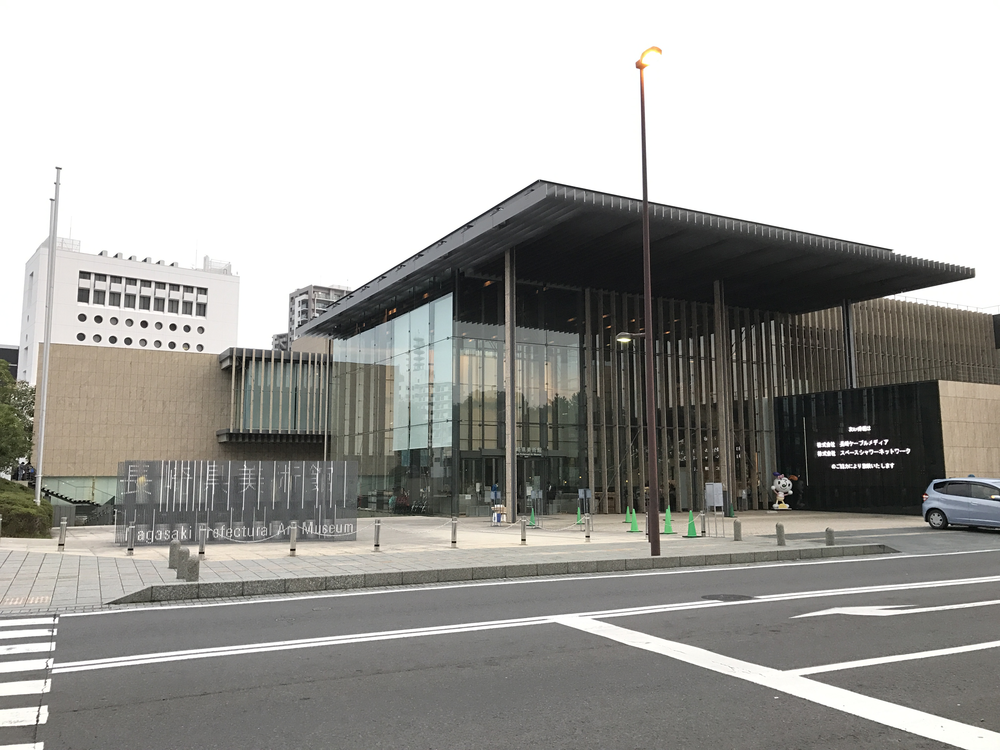

雖然沒去過幾次，但我對長崎有種特殊的情感。我不否認有 87%是因為まどか，但除此以外我仍然蠻喜歡這個城市。如果要我在福岡以外挑一個城市居住，那大概就是長崎了吧。上一次來到長崎時我留下了很棒的印象。時值總選期間，長崎站也擺了まどか的傳單，走在街上我一直想，這就是まどか曾經居住過的城市。我喜歡這個城市雖然小，卻因此更緊密及溫暖的感覺。

所以，我偶然看到了在長崎美術館舉辦的古代希臘展的海報，就這麼決定了再找個時間跑一趟長崎，行程是一如往常地隨興。有點太隨興了，今日有感票應該早點訂的…。

我一直秉持旅行時用餐預算比平常高的方針。其實類似的餐點博多站也有，只不過不是蕎麥麵而是配白飯。我喜歡蕎麥麵也喜歡牛舌，兩個東西合在一起叫我怎麼能不嘗試，絕對不是因為這家不用排隊。

展覽內容跟我想像的稍微有點差距，這大概歸咎於我對「古代希臘」的理解錯誤。才疏學淺就不多做評論了。不過希望能多點敘事啊。沒做功課去看有點辛苦。

我蠻喜歡まどか也說過好幾次的異國感。對習慣日本生活的我來說，長崎是少數能讓我有異地感的城市。從荷蘭坡走到天主堂，看到路牌寫著通學路，竊想就算不是まどか，此刻我也正走在某個學生揮灑過青春的足跡上。抱著再度拜訪曾經合照過的位於天主堂前的岩崎本舖的念頭，結果まどか立牌竟然被換成ゆるキャラ的玩偶了，讓我當場想大喊俺のまどかちゃんどこ～？(語尾上揚)

這次旅行最大的遺憾就是沒做聖地功課，樓梯篇的攝影地點其實離天主堂很近的樣子…。就當作是再來一次長崎的預告吧。但從天主堂走到水辺の森公園時停下吹了一陣子海風，想想雖然時間緊迫沒能停留太久，但還能找到空閒停下腳步「浪費」一下時間，也不錯吧。

