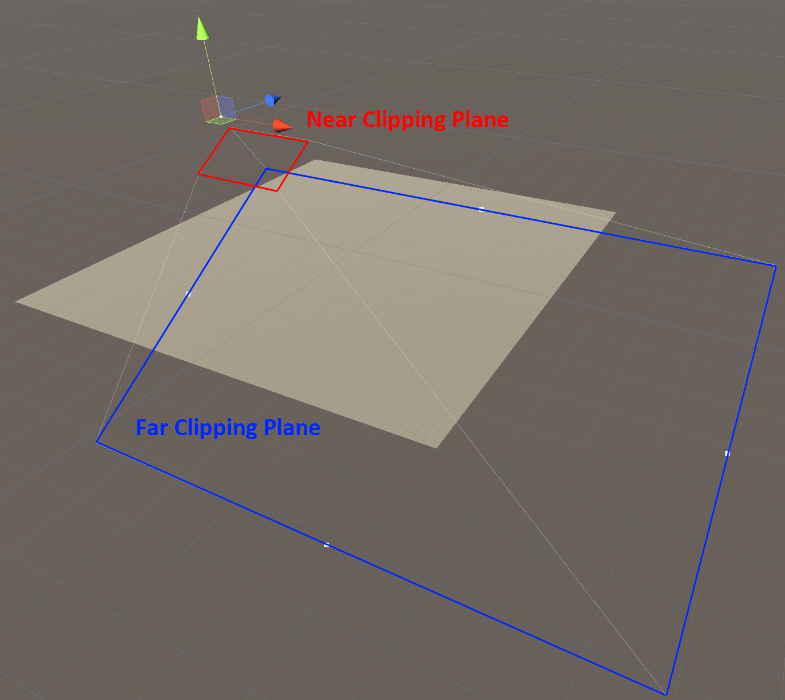
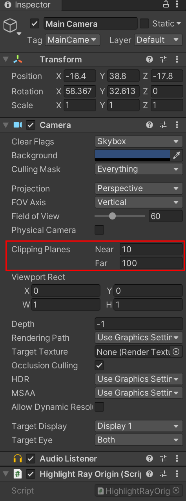
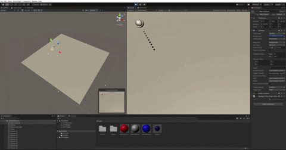
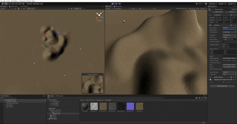
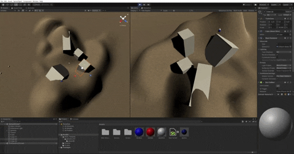

## Raycast

在使用滑鼠的 3D 遊戲中，幾乎與任何物件互動都需要使用滑鼠，判斷玩家游標的位置自然是非常重要且基礎的技術。然而相對 3D 世界的三維座標，存在於螢幕上的游標只有二維座標的 X 軸與 Y 軸兩個數據代表位置，這使得在遊戲世界中精準定位游標位置變得困難。

不過，大多數想要在遊戲中取得游標位置時，都是為了與存在該位置的物件互動。這個物件就能成為定位游標的輔助工具，只要計算從玩家視角中的游標，是否真正與遊戲世界中的該物件重合即可。

具體來說，這個判斷方式是從攝影機朝向滑鼠的二維座標射出一道直線，並判斷該射線所相交的物件。

### Plane.Raycast

先從這個技術的最基本實作，也就是判斷滑鼠在純平面上的座標開始。

```csharp
using UnityEngine;

public class GetMousePos : MonoBehaviour {
    Plane plane = new Plane (Vector3.up, 0);
    Camera camera;
    Vector3 mousePos;

    void Start () {
        camera = Camera.main;
    }

    void Update () {
        float distance;
        Ray ray = camera.ScreenPointToRay(Input.mousePosition);
        if(plane.Raycast(ray, out distance)){
            mousePos = ray.GetPoint(distance);
        }
    }
}
```

一行一行解讀：

```csharp
Plane plane = new Plane (Vector3.up, 0);
```

從[官方文件](https://docs.unity3d.com/ScriptReference/Plane-ctor.html) 可以查到 Plane 的 constructor 是長這樣： `Plane (Vector3 inNormal, float distance)` 。

以三維座標 (0, 0, 0) 為基準點，基於法線方向 `inNormal` 在距離基準點 `distance` 的位置創造一個平面。 `Vector3.up` 就等於 `Vector3 (0, 1, 0)` ，也就是筆直朝向 Y 軸上方的向量。這個 plane 不會顯示在遊戲中，如果想要用視覺理解 plane 的概念，可以直接在 Editor 中新增一個 rotation 與 position 都為 (0, 0, 0) 的 Plane，這兩個平面基本上相同。

```csharp
   Camera camera;
   Vector3 mousePos;
   void Start () {
       camera = Camera.main;
   }
```

將目前使用的主攝影機存為變數，並預先設立儲存滑鼠位置用的變數。

```csharp
void Update () {
    float distance;
    Ray ray = camera.ScreenPointToRay(Input.mousePosition);
    ...
```

在每次更新時，創建一個空的距離變數 `distance` ，以及一個射線變數 `ray` ，起點為攝影機的 near clipping plane，方向為滑鼠位置。

攝影機的顯示範圍是一個上窄下寬的梯形，頂部距離攝影機較近且面積較小的平面就是 near clipping plane，底部較遠較大的平面就是 far clipping plane。玩家所謂的遊戲視窗大小基本上就等於 near clipping plane， `Camera.ScreenPointToRay` 也就是從 near clipping plane 射向 far clipping plane。



這兩個數值都可以從 camera 的 inspector 調整。



```csharp
		...
		if(plane.Raycast(ray, out distance)){
        mousePos = ray.GetPoint(distance);
    }
}
```

回到程式碼， `plane.Raycast` 中的 `out` 是另一個值得注意的地方。先看 `plane.Raycast` [函數本身](https://docs.unity3d.com/ScriptReference/Plane.Raycast.html)： `public bool Raycast(Ray ray, out float enter);`

這個函數的型別是 bool ，回傳引數 ray 是否與該 plane 相交。然而，部分函數提供額外的回傳值，取得值時必須提供一個空變數與 `out` 關鍵字一起作為引數輸入。 `plane.Raycast` 就是有提供 `out` 回傳值的函數之一，提供的是當相交發生時從 ray 起點至相交點的距離 `distance` 。因此這一段程式碼的作用是，判斷平面 plane 與 ray 是否有相交發生，如果有的話將距離儲存進 distance。現在射線起點，相交距離都知道了，就能計算出滑鼠位置便是從該射線上從起點開始距離 distance 的地方。



以上就是在射線上增加元素使其可視化之後的展示，紅色點是射線起點 (`ray.GetPoint(0)` )，藍色點是與平面相交點（ `ray.GetPoint(distance)` ）。可以看見起點不是攝影機本身，而是在 near clipping plane 上。

### Collider.Raycast

以上都是純平面的情況，實際在遊戲中常常有地形非單純平面的情況，此時可以使用 `TerrainCollider` 來計算射線與地形 terrain 的相交點。

```csharp
using System.Collections;
using System.Collections.Generic;
using UnityEngine;

public class GetMousePos : MonoBehaviour {
    TerrainCollider terrainCollider;
    Camera camera;
    Vector3 mousePos;

    void Start () {
        camera = Camera.main;
        terrainCollider = Terrain.activeTerrain.GetComponent<TerrainCollider>();
    }

    void Update () {
        Ray ray = camera.ScreenPointToRay(Input.mousePosition);
        RaycastHit hitData;
        if(terrainCollider.Raycast(ray, out hitData, 1000)){
            mousePos = hitData.point;
        }
    }
}
```

內容大致相同，只是這次判斷相交點的元素不是平面，而是地形碰撞體 `terrainCollider` ，而這個函數所提供的 out 相交資料也更豐富，不只有距離，而是一整個資料形態 [RaycastHit](https://docs.unity3d.com/ScriptReference/RaycastHit.html) ，包含 point, distance ,collider 等，point 即為射線與 `terrainCollider` 相交點。



上圖就是在不規則地形使用 `terrainCollider.Raycast` 追蹤游標位置的展示，可以看見在右側遊戲畫面中游標移至山脈可見的南側時，左側的編輯器畫面也顯示游標位置的藍點直接跳過山脈北側，同時隨著地形一同起伏。

### Physics.Raycast

以上兩種實作的前提都是射線相交的對象為特定單一物件。想要判斷射線是否相交非特定物件時，使用 `Physics.Raycast` 。這個函數會抓取引數的射線相交的第一個對象，且同樣提供 `out RaycastHit` 資料。

```csharp
using System.Collections;
using System.Collections.Generic;
using UnityEngine;

public class GetMousePos : MonoBehaviour {
    Camera camera;
    Vector3 mousePos;

    void Start () {
        camera = Camera.main;
    }

    void Update () {
        Ray ray = camera.ScreenPointToRay(Input.mousePosition);
        RaycastHit hitData;
        if(Physics.Raycast(ray, out hitData, 1000)){
            mousePos = hitData.point;
						GameObject hitObj = hitData.collider.transform.gameObject;
        }
    }
}
```

`Physics.Raycast` 的提供距離引數做為判斷相交的最大距離，可以依照自己需求設定。



上圖為使用 `Physics.Raycast` 追蹤游標互動物件的展示，使用 `RaycastHit.collider.transform.GameObject` 判斷射線的碰撞體的原物件之後就可以進行互動。

### LayerMask in Physics.Raycast

`Physics.Raycast` 還提供圖層引數過濾判斷射線相交對象。

```csharp
using System.Collections;
using System.Collections.Generic;
using UnityEngine;

public class HighlightRayOrigin : MonoBehaviour {
    Camera camera;
    Vector3 mousePos;
    LayerMask layerMask = 1 << 8;

    void Start () {
        camera = Camera.main;
    }

    void Update () {
        Ray ray = camera.ScreenPointToRay (Input.mousePosition);
        RaycastHit hitData;
        if (Physics.Raycast (ray, out hitData, 1000, layerMask)) {
            mousePos = hitData.point;
						GameObject hitObj = hitData.collider.transform.gameObject;
        }
    }
}
```

`Physics.Raycast` 的 `layerMask` 引數就是指定圖層，只有在這個圖層中的物件才會觸發與射線相交的判斷。

請注意，雖然這個引數的型別是 int，但其實是二進制的 int，所以直接輸入在編輯器中顯示的圖層編號是不會正常運作的，必須以 `<<` 運算子將指定編號以二進制方式儲存在變數中再傳遞給 `Physics.Raycast` 函數。


上圖是使用 LayerMask 過濾可互動物件的展示，只有上層物件位於可互動的圖層中，因此游標在地形或是下層物件時藍點都不會隨之移動。
